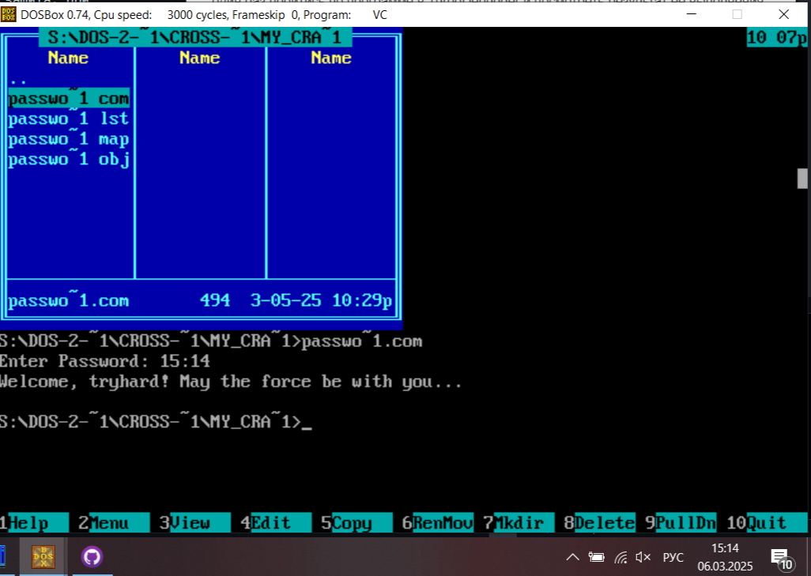

# Перекрестный взлом

## Задание
Написание программы, проводящей авторизацию с помощью ввода пароля с двумя уязвимостями: одной легкой и одной сложной, обмен исходниками программ с напарником и взлом - прохождение авторизации без ввода верного пароля.

## Моя реализация

Легкая уязвимость: специально добавлена функция, подтверждающая авторизацию при вводе текущего времени в системе (например 22:45), для ее обнаружения достаточно один раз пройтись по программе в TurboDebugger и посмотреть результат ее выполнения.

Сложная уязвимость: буфер для ввода строки пользователем хранится в стэковом фрейме соответствуйщей функции, при этом максимальная длина введенной строки составляет 18 байт: запись первых 12 ни к чему не приводит, последующие 4 байта - канареечная защита, при повреждении которой происходит JMP на завершение исполнения программы без исполнения команды ret - возврата из данной функции считывания в буфер. Последние 2 байта - адрес возврата функции. При вводе пароля длиной более 16 байт без повреждения "канарейки" перезапишется. Остается лишь записать адрес начала участка кода, где подтверждается авторизация.

## Взлом crackme напарника

Легкая уязвимость: запись 17-ым байтом 31h = '1' приведет к прохождению авторизации

Сложная уязвимость: в этой программе отсутствует проверка длины введенной строки, поэтому ничто не препятсвует перезаписи адреса возврата на 20 и 21 байтах буфера, куда можно записать адрес функции печати сообщения о прохождении авторизации (01CF) вместо изначального (010A).

